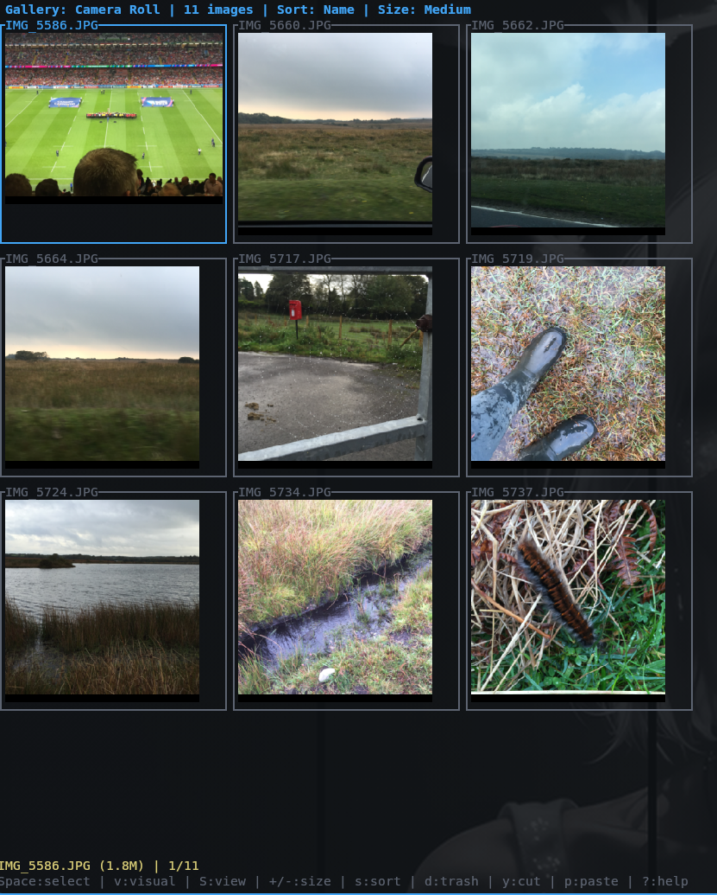
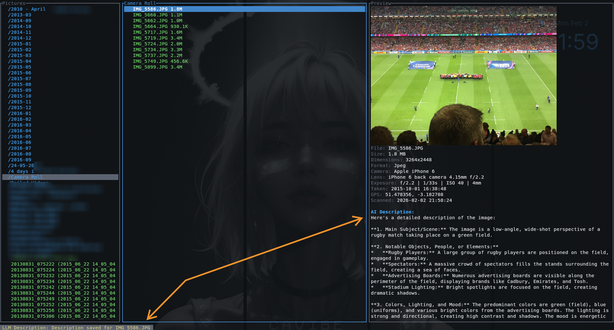
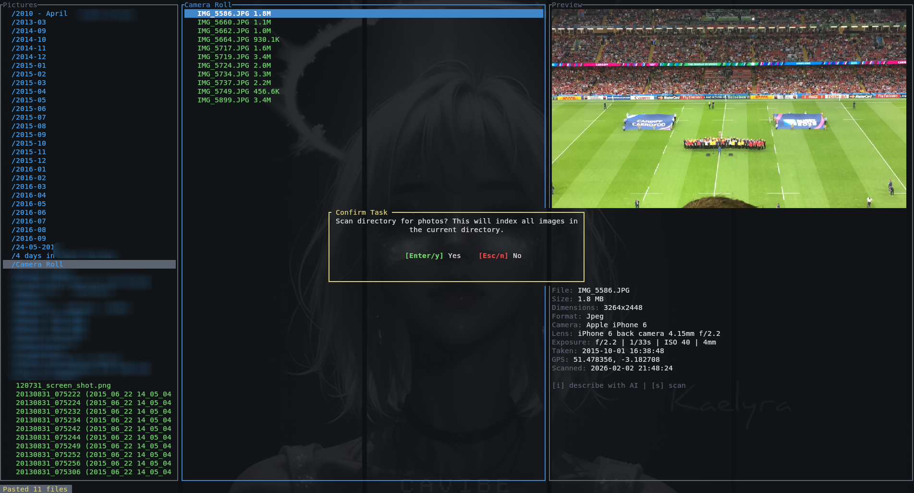
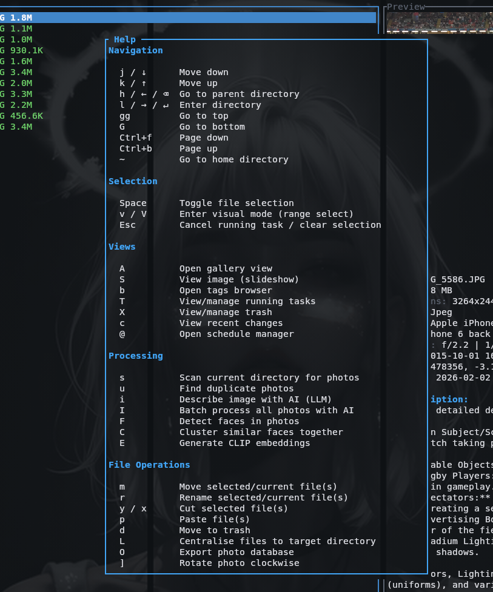

# Clepho

A terminal-based photo manager with AI-powered features. Browse, organize, and catalog your photo collection from the command line.


## Features

- **File Browser** - Three-pane vim-style navigation with image previews
- **Photo Scanning** - EXIF extraction, thumbnails, and metadata indexing
- **Duplicate Detection** - Find exact and visually similar duplicates
- **AI Descriptions** - Generate descriptions via local or cloud LLMs
- **Face Recognition** - Detect, cluster, and name people in photos
- **Semantic Search** - Find photos by natural language descriptions
- **File Operations** - Move, rename, rotate, and trash with undo
- **Gallery & Slideshow** - Visual browsing modes

## Screenshots

### Gallery View

*Browse photos in a grid layout with keyboard navigation and batch selection.*

### AI-Powered Descriptions

*Generate detailed image descriptions using local or cloud LLMs.*

### Photo Scanning

*Index photos to extract EXIF metadata, generate thumbnails, and enable search.*

### Help & Keybindings

*Quick reference for all keyboard shortcuts, organized by category.*

## Quick Start

```bash
# Build from source
cargo build --release
./target/release/clepho

# Or run directly with Nix (no install)
nix run github:barrulus/clepho

# Or install with Nix
nix profile install github:barrulus/clepho
```

Navigate with `h/j/k/l`, press `s` to scan, `?` for help.

See [docs/installation.md](docs/installation.md) for NixOS configuration and other install methods.

## Keybindings

Clepho uses [Yazi](https://yazi-rs.github.io/)-compatible keybindings:

| Key | Action | Key | Action |
|-----|--------|-----|--------|
| `h/j/k/l` | Navigate | `y/x` | Cut |
| `d` | Trash | `p` | Paste |
| `r` | Rename | `.` | Toggle hidden |
| `s` | Scan | `u` | Duplicates |
| `i` | AI describe | `/` | Search |
| `?` | Help | `q` | Quit |

See [docs/keyboard-shortcuts.md](docs/keyboard-shortcuts.md) for complete reference.

## Configuration

```bash
cp config.example.toml ~/.config/clepho/config.toml
```

See [config.example.toml](config.example.toml) for all options or [docs/configuration.md](docs/configuration.md) for detailed documentation.

## Documentation

| Topic | Description |
|-------|-------------|
| [Installation](docs/installation.md) | Build requirements and setup |
| [Navigation](docs/navigation.md) | File browser and preview pane |
| [Scanning](docs/scanning.md) | Photo indexing and metadata |
| [Duplicates](docs/duplicates.md) | Finding and managing duplicates |
| [AI Features](docs/ai-features.md) | LLM descriptions and CLIP search |
| [Faces](docs/faces.md) | Face detection and people |
| [File Operations](docs/file-operations.md) | Move, rename, and organize |
| [Centralise](docs/centralise.md) | Organize photos into library |
| [Keyboard Shortcuts](docs/keyboard-shortcuts.md) | Complete keybinding reference |

## License

GPL-3.0
